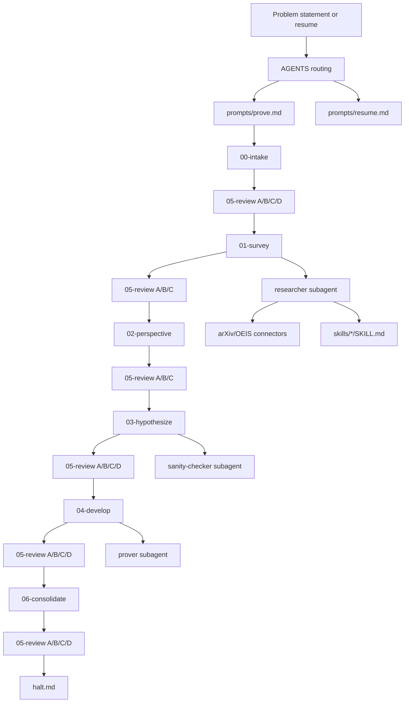

# dianoia

dianoia is a Codex CLI workflow for serious mathematical investigation. It
turns a problem statement into a disk-backed research run with phase artifacts,
claim ledgers, adversarial review, specialist subagents, skills, and connectors.

## What This Is

- A prompt, template, connector, and skill system for math problem attempts.
- A workflow that favors traceable claims over fluent answers.
- A benchmarked experiment in whether agentic scaffolding adds value over a raw
  one-shot attempt.

## What This Is Not

- Not a theorem prover or a guarantee of solved open problems.
- Not a chatbot workflow; ordinary conversation is routed into problem runs.
- Not a license to overclaim: unsupported results are recorded as gaps,
  obstructions, or unverified references.

## Current Benchmark Summary

`BENCHMARK.md` currently has 5 accepted controlled comparisons:

| ID | area | verdict | source |
|----|------|---------|--------|
| B1 | number theory | VALUE_ADDED | APSSV 2026, arXiv:2604.06609 |
| B2 | combinatorics | VALUE_ADDED | Bai-Berczi 2026, arXiv:2604.11326 |
| B3 | geometry | VALUE_ADDED | Samarakkody 2026, arXiv:2603.14663 |
| B4 | probability | VALUE_ADDED | Jana-Rani 2026, arXiv:2604.26499 |
| B5 | algebra | VALUE_ADDED | Caprace-Janssens-Thilmany 2026, arXiv:2601.15266 |

The old MASTERPIECE benchmark and distinct-area requirements are satisfied, but
they are now a baseline rather than a terminal claim. Continuing work focuses on
more reproducible benchmark rows, stronger phase-loop checks, and evidence that
dianoia improves on fresh problems rather than only curated comparisons.

## Architecture

See `ARCHITECTURE.md` for the detailed phase loop, MSP discipline, v4
invariants, meaningfulness gate, and subagent contracts.

## Quick Start

1. Start Codex in the repository root.
2. Type a mathematical problem statement.
3. Use `resume` to continue the active run.
4. Use `halt` to wind down the active run.

Fresh problem statements always create a fresh problem slug, even if
`problems/.active` points to a closed or malformed run.

## Key Paths

- `prompts/`: phase prompts and first-message routing targets.
- `prompts/subagents/`: bounded contracts for researcher, reviewer, prover,
  sanity-checker, surveyor, muser, and specialist-factory work.
- `templates/`: skeleton files for new problem runs.
- `problems/`: active and historical problem artifacts.
- `skills/`: reusable math/research procedures used by subagent prompts.
- `connectors/`: local wrappers for external reference lookup.
- `benchmark-bank/`: controlled comparison sources and comparisons.
- `benchmark-bank/RUNBOOK.md`: required B6+ benchmark protocol.
- `capability-test/`: audit and smoke-test evidence.

## Current Capabilities

- Stale `.active` guards for fresh problem routing and resume/intake safety.
- Local baseline verifier: `python tools\verify_dianoia_state.py`.
  This also checks B6+ source citation metadata and that referenced
  `capability-test/*.md` evidence exists.
- Local phase-loop verifier: `python tools\verify_phase_loop.py`.
- Local routing-guard verifier: `python tools\verify_routing_guards.py`.
- Local connector contract verifier: `python tools\verify_connectors.py`.
- Full local verifier: `python tools\verify_all.py`.
- Five subagent-referenced skills:
  `arxiv-fetch`, `citation-discipline`, `coverage-systems`,
  `pollack-character`, and `sanity-small-cases`.
- Two working connectors:
  `connectors/arxiv/server.py` and `connectors/oeis/server.py`.
- Phase 0-3 evidence showing the original S_a retest moved from unfair
  DEGRADED baseline to VALUE_ADDED after routing fixes.

## Roadmap

The authoritative tracker is `ROADMAP.md`. Current priorities are benchmark
reproducibility, B6+ expansion, phase-loop regression checks, and keeping docs
synchronized as the system changes.

## License

MIT
